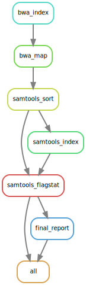

# Multimap

## Introduction :books:


<div style="display: flex;">

<div style="flex: 1; padding-right: 10px;">
<p>This repository contains a data processing pipeline using Snakemake to map FASTQ files to reference genomes, generate coverage statistics, and create a final report in CSV format.</p>
</div>

<div style="flex: 1;">

</div>

</div>


## Pipeline Structure :deciduous_tree:

The pipeline includes the following steps:

1. Reference Indexing - The FASTA files of the reference genomes are indexed with BWA.
2. Alignment - FASTQ files are aligned to the reference genomes.
3. Sorting and Indexing - BAM files are sorted and indexed.
4. Flagstat Statistics - Statistics are generated with samtools flagstat.
5. Final Report - All statistics are compiled into a final CSV file.


## Repository structure :open_file_folder:

This repository contains several folders:

1. `multimap`: contains the Snakefile which defines the rules of the pipeline.
2. `Config`: contains the config.yaml for pipeline configuration.
3. `Script`: Folder with all Python scripts used for the pipeline.

## Usage :computer: 

1. Clone this repository:

   ```bash
   git clone git@github.com:NicolasPoncelet/multi_map.git <folder_name>
   cd <folder_name>
   ```
2. Edit config.yaml with the paths to the FASTQ files, references, and output directory.

3. Run the pipeline locally with Snakemake:

    ```bash
    snakemake --cores <core_number>
    ```

## Dependencies :floppy_disk:

- Snakemake **7.32.4**
- BWA **0.7.17-r1188**
- samtools **1.16.1**
- Python **3.11.0**
- pandas **2.2.3**


## Road map :dart:

- [ ] Add a conda env YAML file.
- [ ] Add a script to handle input file.
- [ ] Add metrics on References and on FASTQ files.
- [ ] Add optionnal rule for trimming FASTQ files.


## Authors :envelope:

This project was developed and is maintained by Nponcelet.

## Contributing :earth_americas:

Contributions are welcome. Whether it's reporting issues, suggesting new features, or improving the documentation, feel free to submit a pull request or open an issue. 

## License :pencil:
This repository is licensed under the MIT License. See the LICENSE file for more details.
